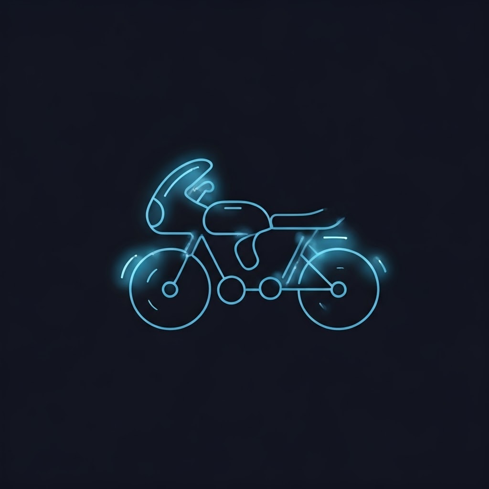

# NeonLightRiders



## Overview

NeonLightRiders is a TRON-like light cycle game where players leave neon trails behind their bikes and must avoid collisions. The game features vibrant visuals, 3D graphics via Three.js, and challenging AI opponents.

## Features

- Stunning neon visuals with 3D graphics powered by Three.js
- Single-player gameplay with up to 3 AI opponents
- Multiple rounds of increasing difficulty
- Radar map showing position of all players
- Spectator/ghost mode after player death
- Explosion particle effects
- Mobile-compatible touch controls
- Customizable game settings

## Installation

### Prerequisites

- Node.js (v14 or higher)
- A modern web browser with WebGL support

### Setup

1. Clone the repository:
   ```bash
   git clone https://github.com/yourusername/NeonLightRiders.git
   ```
2. Navigate into the project directory:
   ```bash
   cd NeonLightRiders
   ```
3. Install dependencies:
   ```bash
   npm install
   ```

## Running the Game

### Development Mode

Run a local development server:

```bash
npm start
```

Open your browser and go to http://localhost:8080

### Production Build

Create a production build:

```bash
npm run build
```

The optimized files will be available in the `dist` directory.

## Game Mechanics

### Overview
NeonLightRiders is a TRON-like light cycle game where players leave light trails behind their bikes and must avoid colliding with walls, trails, and other players.

### Players
- Up to 4 players can participate (1 human + 3 AI)
- Each player has a uniquely colored bike and matching trail

### Controls
- **Keyboard**: 
  - Left/Right arrow keys to turn
  - Tab to switch camera views in ghost mode (after player death)
- **Touch**: 
  - Use on-screen left/right buttons on mobile devices

### Rules
1. Bikes move forward continuously at a constant speed
2. Players can only turn left or right at 90-degree angles
3. Each bike leaves a permanent light trail behind
4. Collision results in bike explosion:
   - Hitting walls
   - Hitting light trails (your own or others)
   - Colliding with other bikes
5. Last bike surviving wins the round
6. Players compete across multiple rounds to determine the ultimate winner

### Game Settings
- **Self Collision**: Toggle whether bikes can collide with their own trails
- **Trail Delay**: Time before trails start appearing
- **Persistent Trails**: Option to keep trails on the grid after a bike explodes

## Project Structure

```
NeonLightRiders/
├── src/                    # Source code
│   ├── js/                 # JavaScript files
│   │   ├── game.js         # Main game logic
│   │   ├── Bike.js         # Bike entity
│   │   ├── Trail.js        # Trail system
│   │   ├── ai.js           # AI opponent logic
│   │   ├── controls.js     # Input controls
│   │   └── ...
│   ├── css/                # Stylesheets
│   ├── utils/              # Utility functions
│   └── index.html          # Main HTML file
└── memory-bank/            # Project documentation
```

## Development

### Contribution Guidelines

1. Fork the repository
2. Create a feature branch: `git checkout -b feature-name`
3. Commit your changes: `git commit -m 'Add some feature'`
4. Push to the branch: `git push origin feature-name`
5. Submit a pull request

## License

This project is licensed under the MIT License - see the LICENSE file for details.

